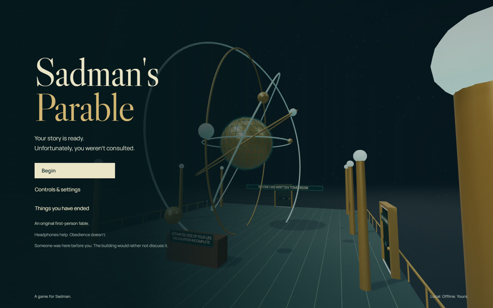
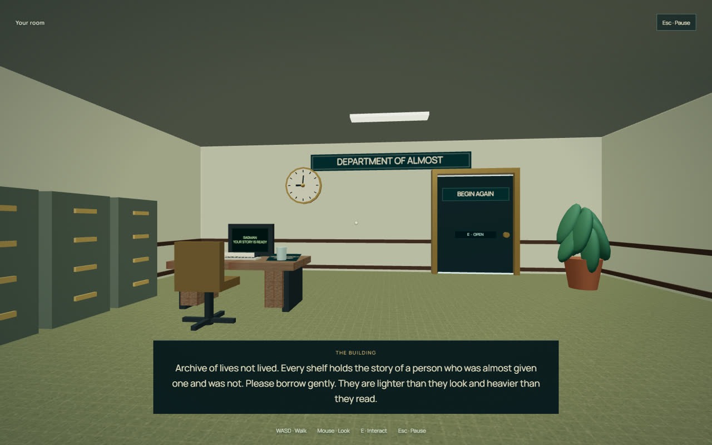
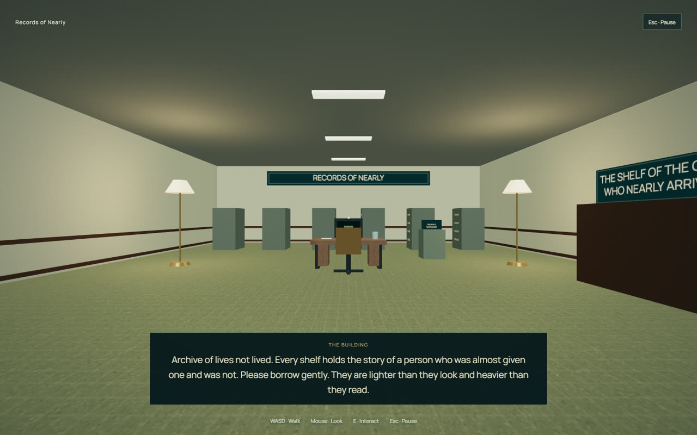
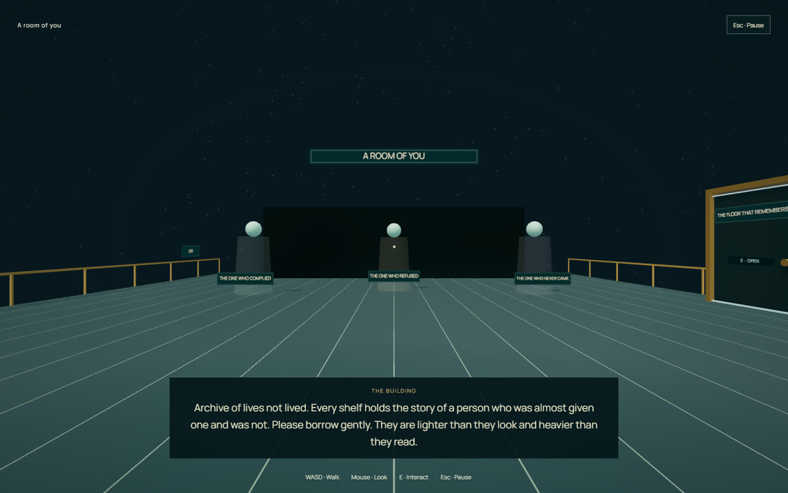
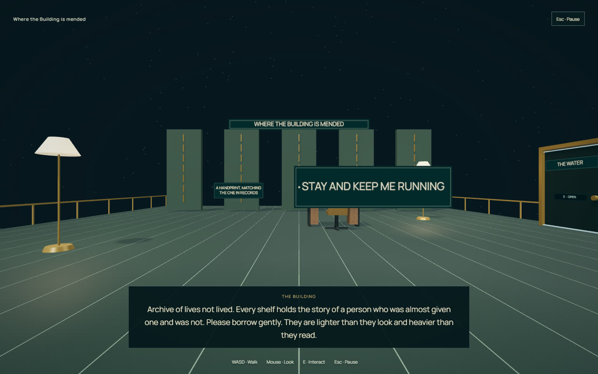
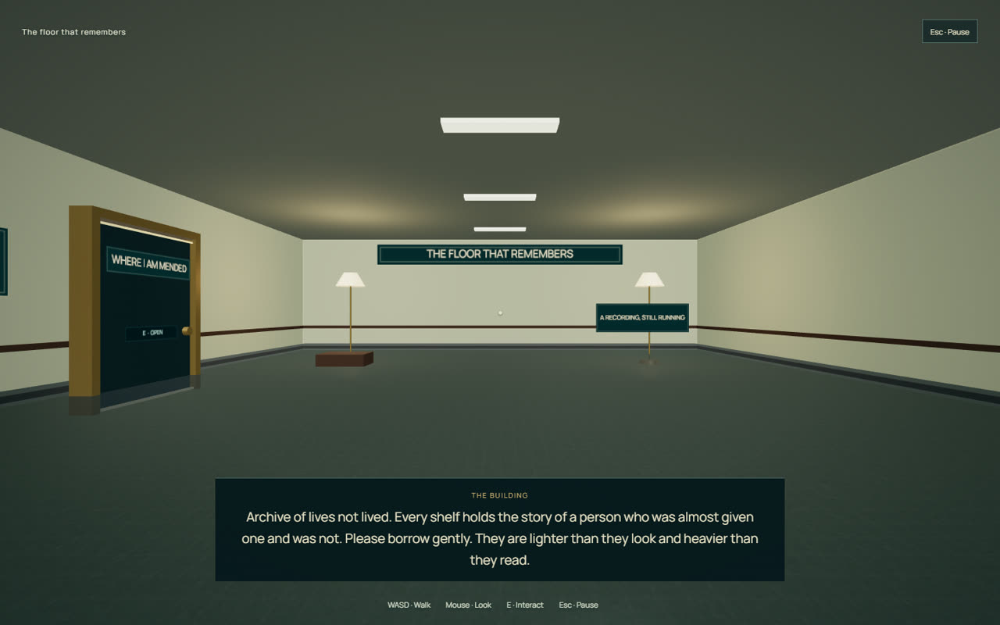
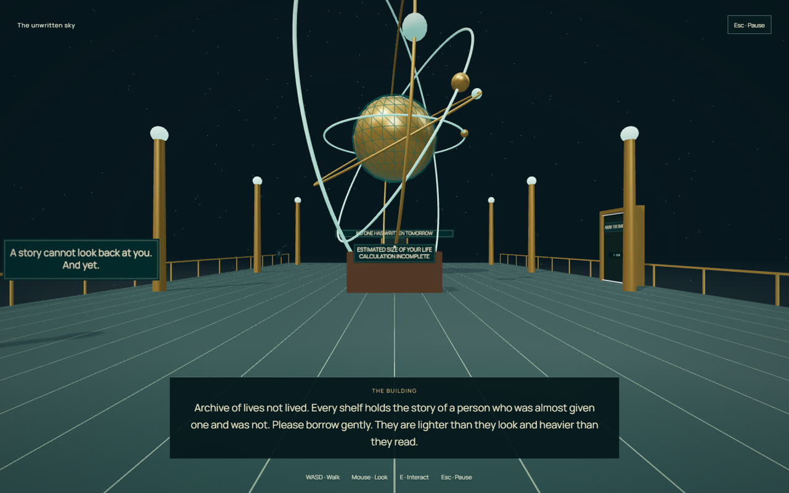
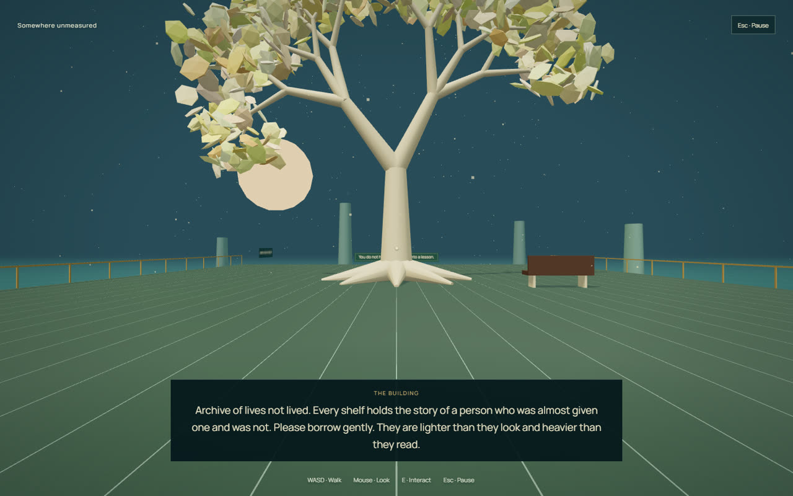
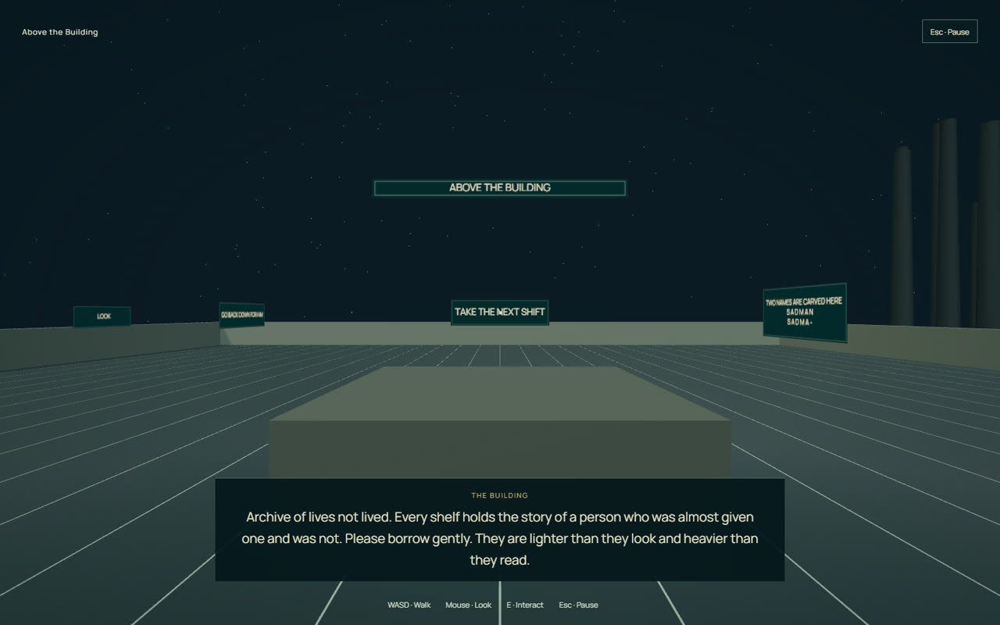
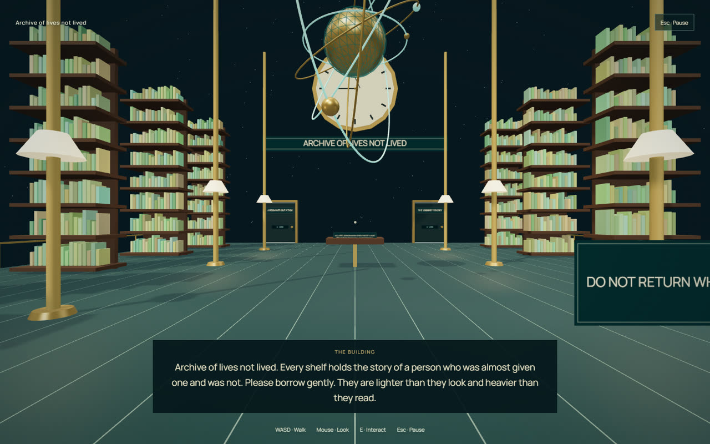

# Sadman's Parable

**Your story is ready. Unfortunately, you weren't consulted.**

An original, first-person psychological fable made for Sadman. A building approved your life at nine seventeen this morning, before you had done anything. You can obey it, undermine it, or go looking for the person who was standing where you are standing when the file was first opened.

## Not affiliated

Sadman's Parable is an original work and an **unaffiliated homage**. It is not affiliated with, endorsed by, sponsored by, or approved by Crows Crows Crows, Galactic Cafe, or the creators of *The Stanley Parable*.

It contains **no** dialogue, art, level layout, character, music or voice recording from that game. All writing, geometry, textures and audio here were created for this project, and the optional narration uses an installed operating-system voice rather than any actor's performance. The inspiration is structural — an unreliable narrator commenting on player choice — which is a genre convention this game shares with many others.

If you are a rights-holder and would like something changed, please open an issue.

## Play

Double-click **PLAY.bat** in this folder. It opens the standalone game in a dedicated Chrome app window when Chrome is installed.

Alternatively, open **Sadman's Parable.html** in a current desktop Chrome or Edge. The HTML is the whole playable game: it does not need Node, an install, a server, an account, an internet connection, or any of the other files.

Click **Begin**, then click the world if your mouse is not captured. Approach a door or object, look at it, and press **E** when the interaction prompt appears. Doors are opened with E rather than by simply walking into them.

The included localhost server is only a development alternative: `npm start` serves the built edition at `http://127.0.0.1:5238`. It is loopback-only.

## Controls

| Control | Action |
|---|---|
| W A S D | Walk |
| Mouse | Look |
| E, or click a highlighted object | Interact |
| Shift | Walk impatiently |
| Esc | Pause / release the mouse |
| Left / right arrows | Turn without mouse capture |
| Up / down arrows | Walk without mouse capture |
| Drag the world | Look if capture is unavailable |
| H | Toggle the room label and control tips |
| V | Toggle local narration |
| M | Mute all sound |

Pause contains **What you have found** (the clue dossier), **What the building said** (a full dialogue transcript), honest return-to-room/title controls, sensitivity, reduced camera motion, and rendering-detail settings. The player is always in control; there is no demonstration autopilot.

## What is here — without spoiling the endings

- **Sixteen explorable spaces**, from a mundane office to suspended archives, the building's own back rooms, and an astronomical impossibility.
- **Twelve endings**, only the ones you personally find are named on the title screen.
- **A connected storyline, not a set of gags.** The department keeps a file on Sadman that is older than Sadman. Five traces of whoever came before — a page, a photograph, a recording, a handprint, a name — assemble the answer. Two spaces stay sealed until you have earned your way in, and a gate always refuses in words rather than in silence.
- An unreliable narrator that starts as a pompous administrator and turns out to be something much sadder, moving goalposts, a corridor with questionable intentions, and several legitimate ways to refuse the whole experiment.
- Wonder, quiet, and real tenderness underneath the provocation — the warmest ending in the game is also the hardest to reach.
- Original writing, geometry, procedural textures, and synthesized ambient sound.
- Optional narration using an installed **local English** system voice. No cloud voice, no imitation of Stanley Parable's actor. Captions contain the complete story.
- Settings, current room checkpoint, discovered endings and discovered traces saved locally when browser storage is available. Continue starts at the room entrance, not an exact saved footstep. A browser or path change may create a separate save store.

## Screenshots

Real WebGL frames from the local build, captured through the browser's own debugging protocol and downscaled to 1280px. They are verification evidence, not promotional renders.

| | |
| :--: | :--: |
|  |  |
| Title — your story is ready | Your room, where the file begins |
|  |  |
| Records of Nearly | A room of you |
|  |  |
| Where the Building is mended | The floor that remembers |
|  |  |
| The unwritten sky | Somewhere unmeasured |
|  |  |
| Above the Building | Archive of lives not lived |

## Technical requirements

Desktop keyboard and mouse, a current WebGL-capable browser, hardware acceleration. Automatic rendering detail can lower GPU load. Low detail and reduced camera motion can be chosen explicitly.

Mobile layouts are checked for readable menus, but **this is not a touch-controlled mobile game**.

## Verification

See `VERIFICATION.md` and the machine-readable reports in `qa/`. Coverage includes a pure gameplay-reducer suite, real keyboard input, physical interaction raycasts in the authorised local browser, all sixteen room builds, all twelve endings, both clue gates, the dossier, resource disposal across repeated scene replacement, and a standalone-file run with browser networking forced offline. Every one of the 74 in-world interaction targets was verified reachable by an actual camera ray from a collision-valid standing position.

This is automated coverage, not a claim of a complete human playthrough or long-duration stability.

## Source and build

The complete source project is kept in this E: folder. `src/main.js` owns the runtime, `src/world.js` the authored world, `src/rules.js` the testable choice system, `src/story.json` the narrative (98 authored lines, 12 endings), and `src/audio.js` the local soundscape.

With Node installed: `npm install`, `npm test`, `npm run build`. Build creates the named standalone HTML and `dist/index.html`. The root `index.html` is a source template, not the playable file.

QA shortcuts exist **only** when `?qa=1` is explicitly supplied to a test URL. Normal launch does not enable them or persist QA discoveries.

## Credits

Created for Sadman. Inspired by The Stanley Parable's unreliable narration and player/narrator tension; no copied dialogue, levels, characters, recordings, or game assets.

Three.js (MIT), Libre Caslon Display (SIL OFL), and Manrope (SIL OFL). License texts are in `licenses/`; provenance is in `THIRD-PARTY-NOTICES.md`.
